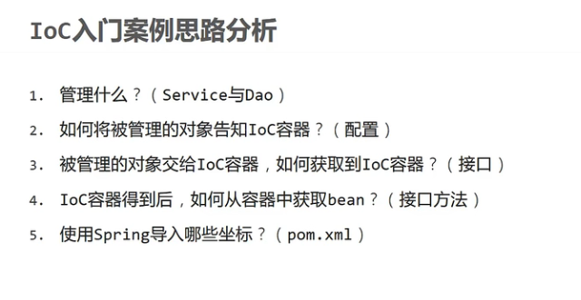

# Web 知识

> - **DAO (Data Access Object)：**
    >
    >   - **定义**：DAO 是一个用于与数据库交互的对象，其目的是封装对数据的所有访问细节。DAO 通常为每个数据库表提供一个接口。
>
>   - 功能：
      >     - 执行 CRUD（创建、读取、更新、删除）操作。
>     - 封装数据库查询和更新命令。
>     - 将数据库查询结果转换为 Java 对象或数据结构。
>
>   - 好处：
      >     - 分离了数据访问逻辑和业务逻辑，增加了代码的模块化。
>     - 可以轻松更换数据库存储方式，例如从关系型数据库迁移到 NoSQL 数据库，而不会影响业务逻辑。
>     - 使代码更容易测试，因为可以用模拟对象代替真实的数据库访问。
>
> - **Service：**
    >
    >   - **定义**：Service 层负责处理应用程序的业务逻辑。它在 DAO 和 Controller（或前端表示层）之间充当一个桥梁。
>
>   - 功能：
      >     - 调用一个或多个 DAO 来完成具体的数据访问任务。
>     - 实现业务逻辑，如数据验证、计算等。
>     - 为上层提供一致的 API。
>
>   - 好处：
      >     - 业务逻辑的中心化，确保逻辑在一个地方进行并且容易修改。
>     - 分离了表示层和数据访问层，使其更具模块化。
>     - 提供一个统一的入口点来处理业务操作，使其更容易维护和测试。

# Spring Framework

## 基本介绍


## 管理思想

> - `Inversion of Control` 控制反转
> - `DI`(Dependency Injection) 依赖入住


> - 目标：`充分解耦`
    >   - 使用IoC容器管理bean(Ioc)
>   - 在Ioc容器内将所有依赖关系的bean进行关系绑定(DI)
> - 最终效果
    >   - 使用对象时不仅可以直接从Ioc容器中获取，并且获取到的bean已经绑定了所有的依赖关系


## IOC案例

> - git `f737c15bb81d401f2c7581b8bfd18455d0ccfab7`



## DI

> - git `9def10fd5b325996f9ceee9cd33876d35dd07585`

```xml
<?xml version="1.0" encoding="UTF-8"?>
<beans xmlns="http://www.springframework.org/schema/beans"
       xmlns:xsi="http://www.w3.org/2001/XMLSchema-instance"
       xsi:schemaLocation="http://www.springframework.org/schema/beans http://www.springframework.org/schema/beans/spring-beans.xsd">

    <!--1.导入spring 的坐标spring-context-->

    <!--2. 配置bean-->
    <!--bean标签标示配置bean
    id属性名字表示给bean起名字
    class属性表示给bean定义类型
    -->
    <bean id="bookDao" class="com.example.ssmstudy.dao.impl.BookDaoImpl"/>
    <bean id="bookService" class="com.example.ssmstudy.service.impl.BookServiceImpl">
        <!--7. 配置server 与dao的关系-->
        <!--property标签表示配置当前bean的属性
        name属性表示配置那一个具体的属性
        ref属性表示参照那一个bean
        -->
        <property name="bookDao" ref="bookDao"/>
    </bean>


</beans>
```

# Bean配置

## 基础配置


## 别名配置


